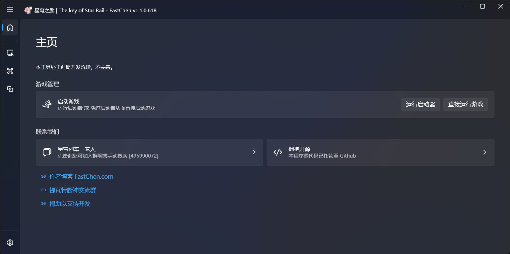
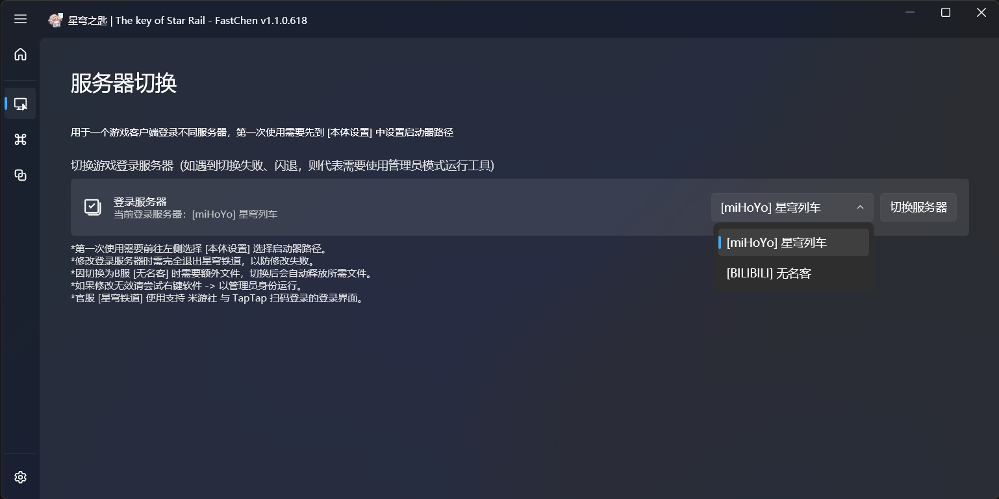
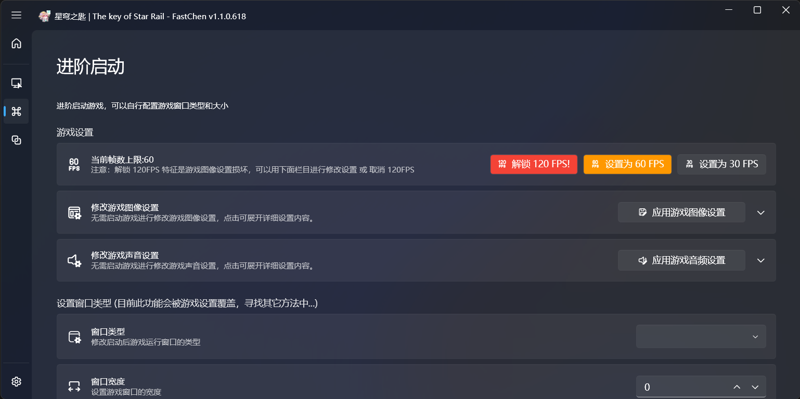
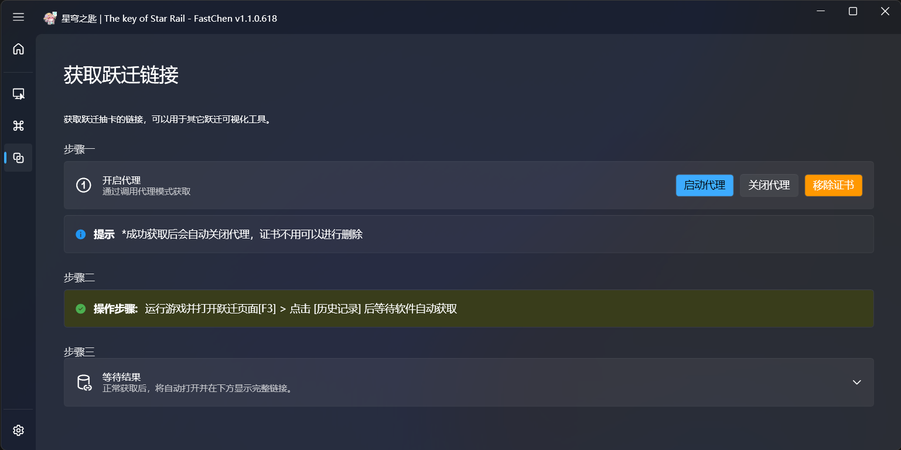
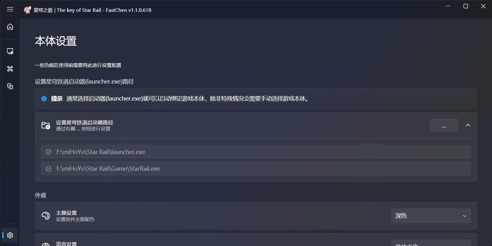

   
  
  <h3>星穹之匙 - The key of StarRail</h3>
  <h4>(一个<a href="https://sr.mihoyo.com/" target="_blank">星穹铁道</a>工具 - A Star Rail Tool) </h4>
  
  
  

## 《星穹之匙》

#### 为什么制作这款工具？

这款工具制作原因是我之前为原神制作过类似的工具软件 —— 《[提瓦特之匙](https://github.com/FastChen/The-Key-of-Teyvat)》

## 主要功能

- 支持切换登录服务器：星穹列车(官服)、无名客(B服)
- 支持解锁 120 FPS 上限 (官方自身支持的功能非内存注入，安全稳定)
- 支持软件提前修改游戏的 图像设置 与 声音设置。
- 可以获取 跃迁链接 (可以用于其它抽卡分析工具)

## 预计更新功能

- [ ] 考虑将 Titanium.Web.Proxy 更换为 Yarp.ReverseProxy
- [ ] 其它暂时未定，可通过 Issue 进行提交

## 下载

**仅在下面提供地址发布**

- [星穹列车一家人:495990072](http://qm.qq.com/cgi-bin/qm/qr?_wv=1027&k=L8I9jFbNKaJDKBQutIkcEfElaxBEtFGF&authKey=%2BmS56faj%2FbeeZiJj8Nv32aEjCnwt4GBy52jkFJ1XT1Exxc9UxICteShzKWdZATrI&noverify=0&group_code=495990072)
- [Github Releases](https://github.com/FastChen/Star-Rail-Tool/releases)

## Q&A

**Q：这个工具可以干嘛？**

A：目前可以切换服务器、解锁帧数、更改游戏设置。

---

**Q：使用会导致封号吗？**

A1："怕别用，用别怕，封别叫"

A2：工具都是基于官方自带的功能实现，理论上不会封号。因为不是操作内存注入什么的那种工具。

## 一起讨论游戏
[星穹列车一家人:495990072](http://qm.qq.com/cgi-bin/qm/qr?_wv=1027&k=L8I9jFbNKaJDKBQutIkcEfElaxBEtFGF&authKey=%2BmS56faj%2FbeeZiJj8Nv32aEjCnwt4GBy52jkFJ1XT1Exxc9UxICteShzKWdZATrI&noverify=0&group_code=495990072)

## 捐助支持

[捐助我们](https://docs.nullcraft.org/donate) | [爱发电](https://afdian.net/@fastchen)

## 一些图片

## License

- 使用 WPF-UI 库作为软件 UI 界面
- 使用 Titanium.Web.Proxy 库用于跃迁链接获取